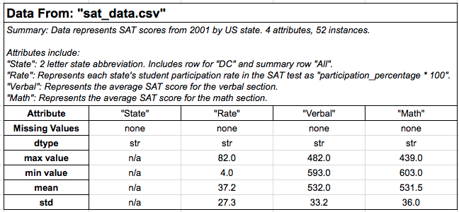
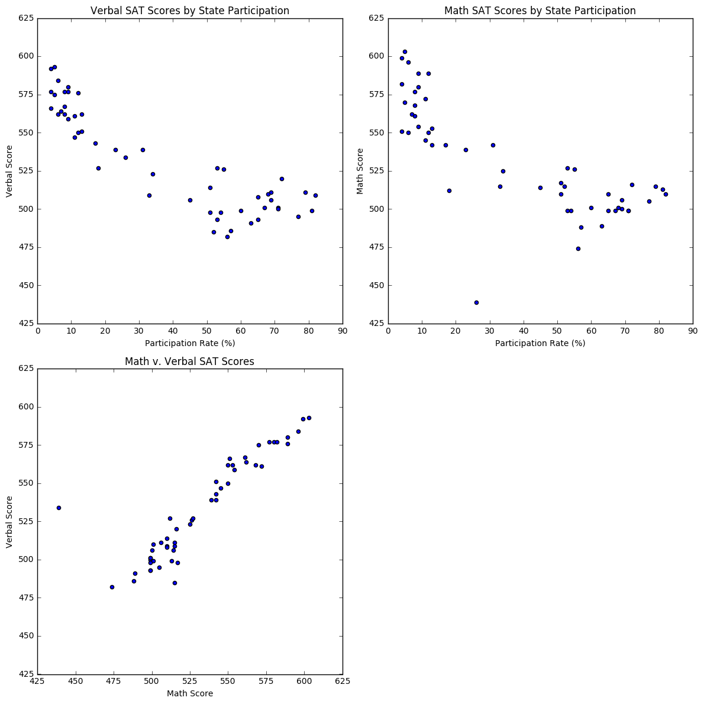
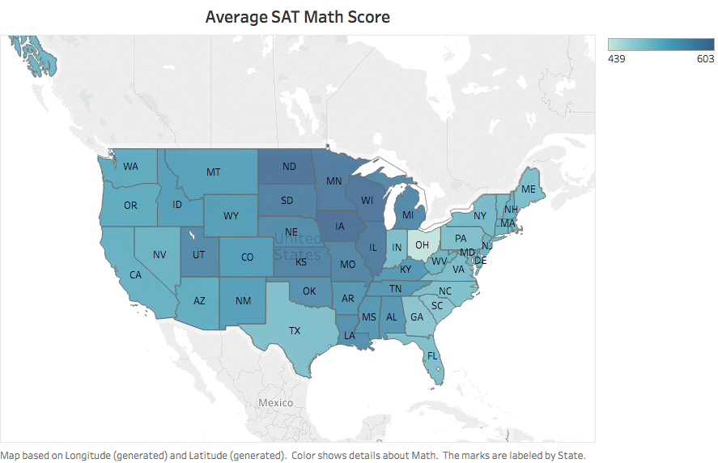
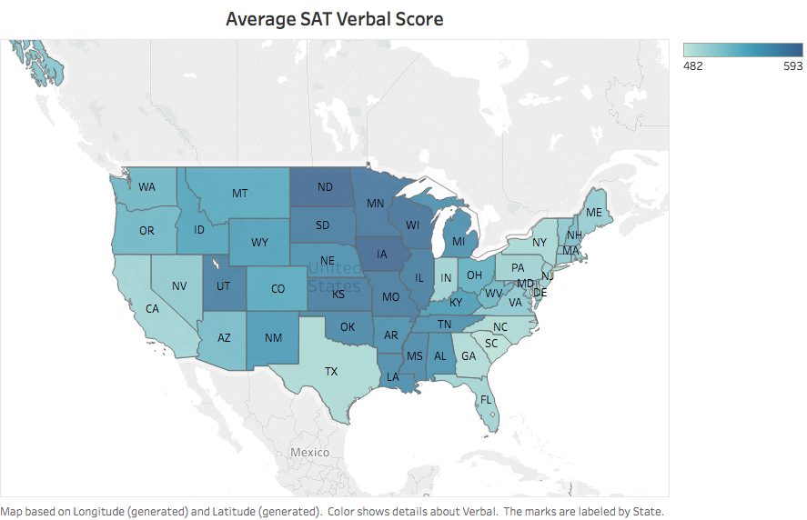
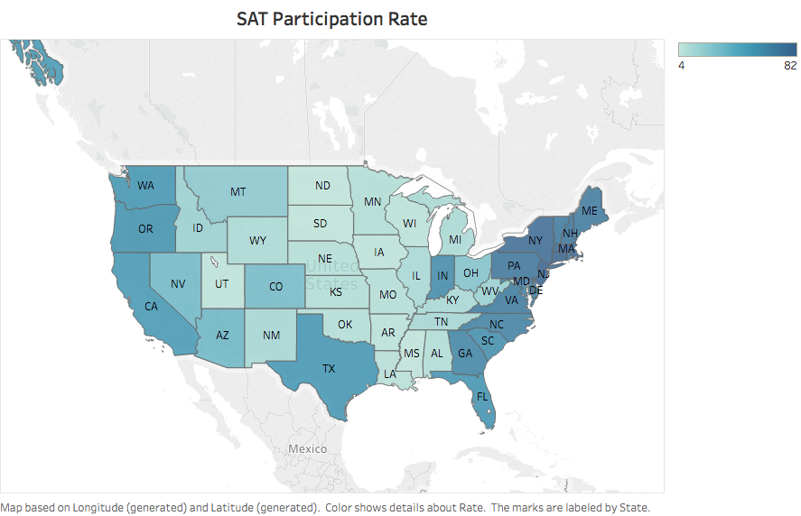

# United States SAT Scores (2001)
## Introduction
In this first project for General Assembly's Data Science Immersive program we were tasked with investigating the average SAT scores by US State from 2001 for our client CollegeBoard.com. The goal was to read in a .csv file and explore the dataset using descriptive statistics and data visualizations.

## The Data
The dataset is taken from CollegeBoard.com and provides the average SAT score by state for both the Math and Verbal sections. Also provided are the student participation rates for for each state. View dataset: 

Fig 1. (Summary of Data)

## Data Cleaning
The csv file provided by CollegeBoard.com was well structured and did not contain any missing or "NaN" values.

I imported the csv module and read the 'sat_data.csv' into a list of lists using the csv.reader() method. After printing the resulting list I noted that the data within each column was of "str" type. I reassigned the data type of the 3 numeric columns (Rate, Math, & Verbal) using the below 'for loop':

    for row in SAT_data:
    row[1] = int(row[1])
    row[2] = int(row[2])
    row[3] = int(row[3])  

## Assumptions  

Two assumptions were made related to the "State" column.
* The first was to include the row State="DC" in the dataset. Although Washington DC is technically not a state, DC residents contribute to the total US population and are therefore relevant to the analysis.
* Second, the row where State = "All" was removed from the dataset. It made sense to remove this row from the dataset given that it is itself a summary statistic. I did this using list splicing:

    SAT_data = SAT_file[1:52]

## Computing Summary Statistics

In order to gain a better sense of the data I computed the min, max, and standard deviation of each numeric column.  

    min and max were calculated using list comprehension for each column as follows:

        max_rate = max([row[1]for row in SAT_data])
        min_rate = min([row[1]for row in SAT_data])

        Output:
        max_rate: 82
        min_rate: 4
        max_verbal: 593
        min_verbal: 482
        max_math: 603
        min_math: 439

From these values, it would appear the there is a large degree of variability in State SAT participation rates. These values also suggest that there is more variability in Math scores compared to Verbal.

Taking it a step further, I then calculated the standard deviation (std), mean, median, and mode for each numeric column. I first created a function to calculate each statistic as follows:

        def std_dev(row_index):
    	    return np.std([row[row_index] for row in SAT_data])

        def mean(row_index):
         return np.mean([row[row_index] for row in SAT_data])

        def median(row_index):
             return np.median([row[row_index] for row in SAT_data])

        def calc_mode(row_index):
             return mode([row[row_index] for row in SAT_data])

Passing in the row indices of the numeric columns as arguments yielded the following results:

        Output:

        STANDARD DEVIATION
        Rate: 27.0379964945
        Verbal: 32.9150949616
        Math: 35.6669961643

        MEAN:
        Rate: 37.0
        Verbal: 532.529411765
        Math: 531.843137255

        MEDIAN:
        Rate: 33.0
        Verbal: 527.0
        Math: 525.0

        MODE:
        Rate: ModeResult(mode=array([4]), count=array([3]))
        Verbal: ModeResult(mode=array([562]), count=array([3]))
        Math: ModeResult(mode=array([499]), count=array([6]))

The biggest take away from these measures is that the STANDARD DEVIATION supports our hunch that there is more variability in the Math (std=35.7) scores compared to Verbal (std=32.9).

Also, given that the MEAN > MEDIAN for each numeric column, there is a positive skew to each distribution. However, it is not clear this is a significant level of skewness.

## Data Visualization

### ScatterPlots

To get a better since of how each column in sat_scores.csv relate to each other I plotted three scatterplots (Participation Rate v. Verbal Score, Participation Rate v. Math Score,  and Math Score v. Verbal Score).

SAT Score v. Participation Rate

* There appears to be a negative correlation between Participation Rate and Verbal Score.

* Similarly, we observe a negative correlation between Participation Rate and Math Score. However there was one significant outlier to this trend within the Math distribution. OH: [26, 534, 439], where the participation was low (26%) and the Math Score was very low (439).

* One possible explanation for this negative correlation is that in states with lower participation only higher achieving students are expected to take the exam.

Math Score v. Verbal Score

* There appears to be a strong positive correlation between Math and Verbal SAT scores.

* This observation feels intuitively accurrate. It seems likely that a student's achievement across subjects would be strongly correlated.

### Heatmap

To get a better sense of how SAT scores and participation rates vary across the US I generated three heatmaps for each numeric column using Tableau.  Each map highlights the variability in the data such that States with higher scores (or participation rates) are shaded in darker blue.

* From the two SAT score maps we can see that the highest scores appear concentrated in the central heartland states.

* Again we observe the inverse relationship between SAT scores and participation rate we saw in the scatterplots. The states with the darkest shading in the score maps are largely the states with the lightest shading on the participation map.   

