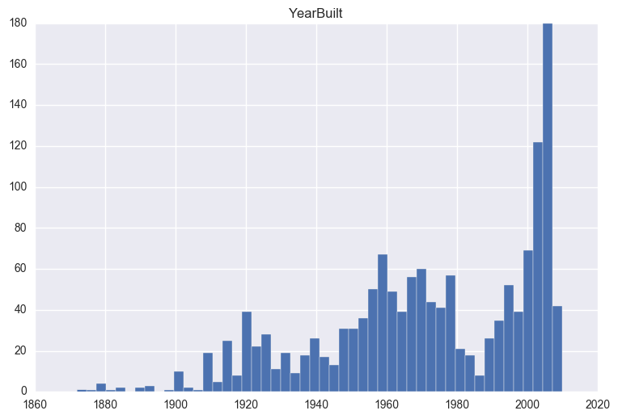
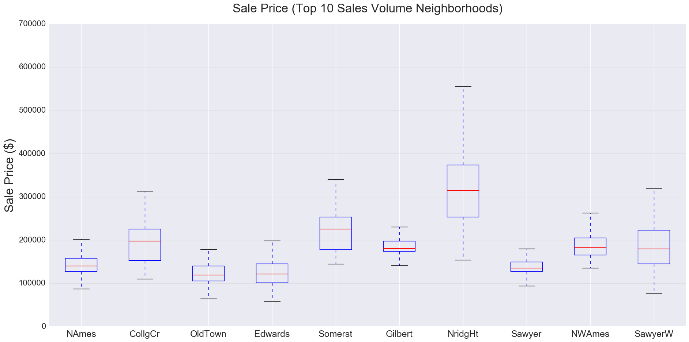
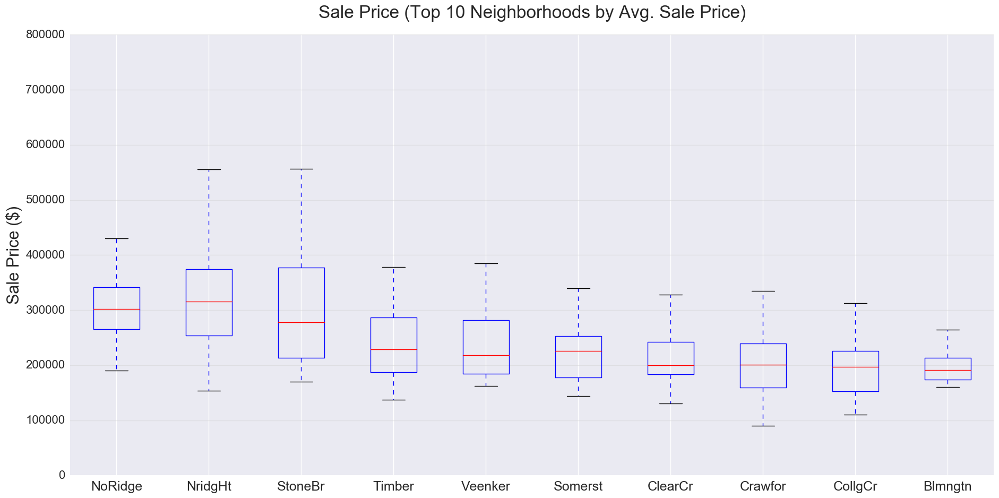
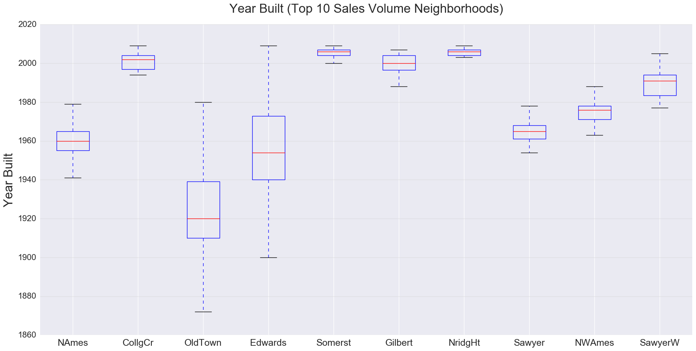
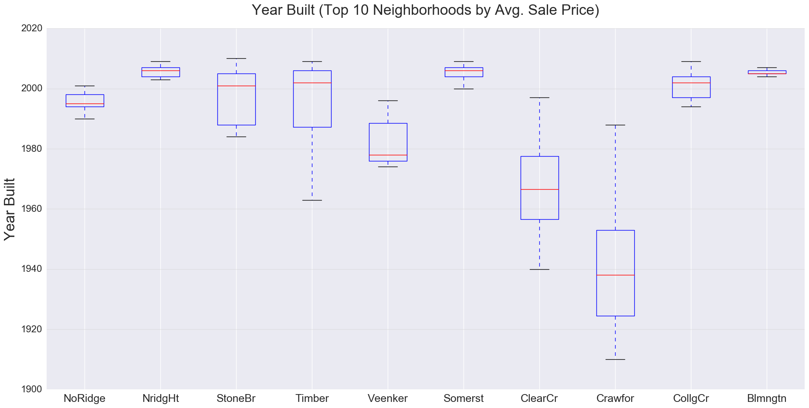
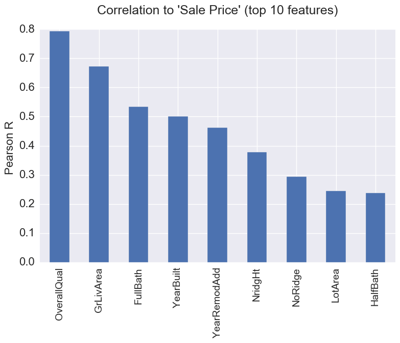
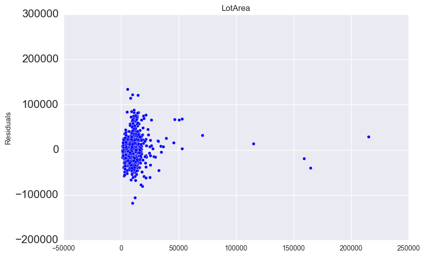
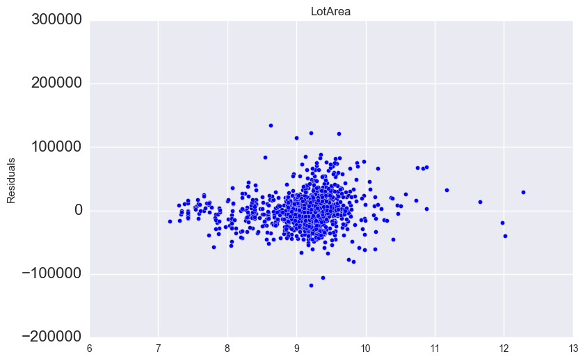
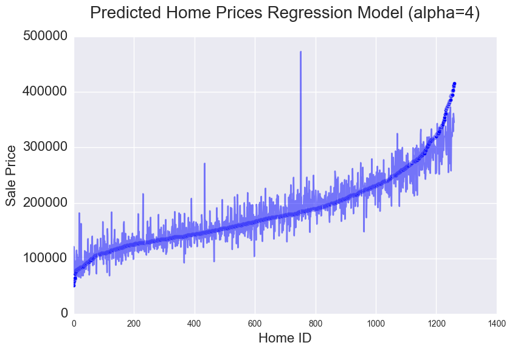

# Housing Prices

## Introduction
In project 3 for General Assembly's Data Science Immersive program we were tasked with taking on the role of a consultant for a real estate firm located in Ames, Iowa. Our goal was to build a regression model to predict prices. We also tried to to give some insight into which areas had the highest sales prices and highest sales volume.

## The Data
The dataset set was taken as a subset from Kaggle.com. We selected 19 features from the total 82 feature data set:

      LotArea          int64
      Utilities       object
      Neighborhood    object
      BldgType        object
      HouseStyle      object
      OverallQual      int64
      OverallCond      int64
      YearBuilt        int64
      YearRemodAdd     int64
      RoofStyle       object
      RoofMatl        object
      GrLivArea        int64
      FullBath         int64
      HalfBath         int64
      BedroomAbvGr     int64
      KitchenAbvGr     int64
      MoSold           int64
      YrSold           int64
      SalePrice        int64

## Data Exploration
For the purposes of initial data exploration I was concerned primarily with the target variable 'Sale Price' as well as the features 'Neighborhood' and 'YearBuilt'.

Looking at a histogram of 'Sale Price' we see a positively skewed distribution with a few high priced outliers.

Looking at 'YearBuilt' we see a negatively skewed distribution with a few outlier values representing very old homes. The distribution also shows two peaks around 1960 and a large peak in the mid 2000s.

I wanted to understand the relationship between 'Neighborhood' and 'Sales Price'. Given the large number of unique values in the 'Neighborhood' feature I subset the column on the Top 10 neighborhoods by Sales Volume and Average Sales Price.

## Top 10 Neighborhood by Sales Volume

* Most high volume neighborhoods showed minimal 'Sale Price' variability and had mean Sale Prices fairly close to the population mean.
* NridgHt was one outlier to this trend with a mean Sale Price over $300K.
* 'NoRidge' has the highest average sale price of any neighborhood.
* Most of the top average sale price neighborhoods did not have a huge amount of variability in sale price. NridgHt and StoneBr were exceptions to this trend showing more variability.
  

  

## Top 10 Neighborhood by Average Sales Price

* As with the high volume neighborhoods, the high average sale price neighborhoods showed a large degree of variability in year built.
* High sales volume neighborhoods showed variability in terms of 'Year Built'. In some neighborhoods such as CollCr, Somerst, Gilbert, and NridgHt nearly all homes sold were built after 2000. Others like OldTown and Edwards had a much larger variance with a much older mean 'YearBuilt'.
  

  

## Regression Analysis
### Methods and Assumptions

#### Dummy Variables

In order to perform a statistical analysis on my entire data set I first had to convert some of the features to numeric values. I 'dummied' (converted to 0s and 1s the variables 'Utilities', 'Neighborhood', 'BldgType','HouseStyle','RoofStyle','RoofMatl', and 'MoSold'. This increased the  total number of feature columns from to 19 to 71.

#### Outliers

I next wanted to address some outliers within the data. Given the positive skew in the 'Sale Price' target variable, I decided to only include rows with a 'Sale Price' within 3 standard deviations of the mean. I made the assumption that extreme home values are less predictable and therefore would negatively impact the performance of my model.

I also noted that the 'YearRemodAdd' had a large number of outlier values for the year 1950. I made the assumption that this extreme value would negatively impact my model. My logic was that most home buyers would not be concerned about a remodel that happen so far in the past. To keep this column more meaningful I dropped all rows that had 'YearRemodAdd' == 1950.

#### Correlations

Prior to generating my regression model I wanted to first better understand the underlying correlation between the features and the target variable of 'SalePrice'. Unsurprisingly, OverallQual' ranking and 'GrLivArea' were most predictive of 'Sale Price'.

Also noteworthy were the 2 neighborhood variables 'NrdigHt' and 'NoRidge' being in the top 10 correlation features. This observation is a line with our previous findings that these neighborhoods had the highest average sale price.

### Regression Models
I next ran a series of linear regressions on the data.
Using SKLearn I first performed a simple linear regression inclusive of all the features previously modified above:

        R2:0.857692762189
        Mean_Coef_Abs: 45068.7745131
        Cross_Val_Score: 0.735669815285

Next, I performed a Ridge CV regression to determine an ideal alpha value of 4. I passed alpha = 4 into a Ridge regression. The Ridge regression yield an improved model in terms of cross val score:

        R2: :0.834579456205
        Mean_Coef_Abs: 9255.06622012
        Cross_Val_Score: 0.803575065065
        Selected_Alpha: 4

Lastly, I attempted to improve on this ridge model by transforming the 'LotArea' and 'GrLivArea' columns. I had noting that the residual plots of each variable were not randomly distributed, I performed log transformation on each feature (see example below). This action further improved improved my model's cross val score:

        R2: :0.843957221706
        Mean_Coef_Abs: 10467.2040644
        Cross_Val_Score: 0.821187681607

####Residual Plot Prior to Transformation

####Residual Plot Post Transformation

## Conclusion

In this project I was able to give some insight into home prices in Ames, Iowa. Specifically I was able to identify the neighborhood locations that are the drivers of the real estate market both in terms of Sales Volume and Average Sale price. Additionally, I noted that the Ames real estate market has a high variance in terms of 'Year Built'. That is to say both newer and older homes are contributing to sales in the hottest neighborhoods.

By building a regression model on a subset of available features I was able to generate the below model that has a predictive accuracy of 82.1% when cross validated on the sample data.

#### Followup

From here there are many opportunities to expand upon this analysis. I would like to do further exploratory analysis related to the 'OverallQual' and 'GrLivArea' features as these showed the strongest correlation with 'SalePrice'.

I would also like to review the original dataset from Kaggle.com and include additional features in my model to see if could improve performance. Additionally, I would like to do more feature modification such as standardization to see the impact on the regression analysis.
