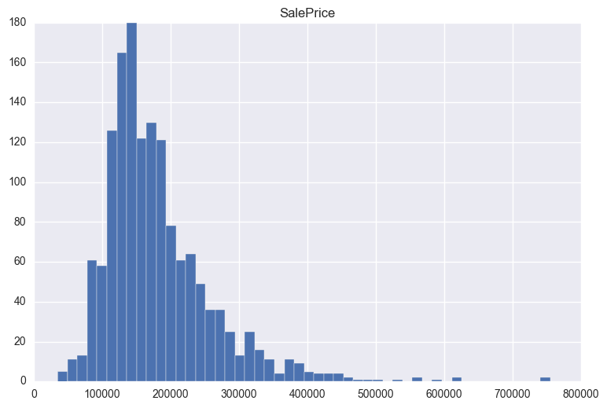

# Housing Prices

## Introduction
In project 3 for General Assembly's Data Science Immersive program we were tasked with taking on the role of a consultant for a real estate firm located in Ames, Iowa. Our goal was to build a regression model to predict predict prices. We also tried to to give some insight into which areas had the highest sales prices and highest sales volume.

## The Data
The dataset set was taken as a subset from Kaggle.com. We selected 19 features from the total 82 feature data set:

      LotArea          int64
      Utilities       object
      Neighborhood    object
      BldgType        object
      HouseStyle      object
      OverallQual      int64
      OverallCond      int64
      YearBuilt        int64
      YearRemodAdd     int64
      RoofStyle       object
      RoofMatl        object
      GrLivArea        int64
      FullBath         int64
      HalfBath         int64
      BedroomAbvGr     int64
      KitchenAbvGr     int64
      MoSold           int64
      YrSold           int64
      SalePrice        int64

