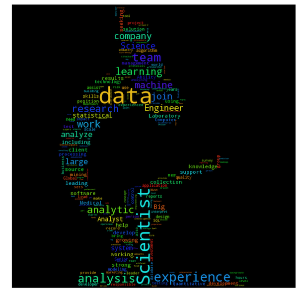
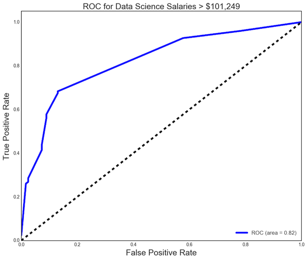

# Classifying Data Science Salaries With Logistic Regression

## Introduction
In this project I sought to understand what factors influence salaries for Data Science career postings. In a highly publicized article from 2012, Harvard Business Review deemed Data Scientist to be the "The Sexiest Job of the 21st Century".  As technological barriers such as computer storage cost and internet access continue to decrease, an ever growing abundance of digital information will be available for analysis. The potential applications from these analyses is huge and driving the demand for skilled Data Scientists through the roof. While there has been some debate on the merits of this claim, the central thesis of the article appears to be supported by the current job market.

I decided to parse the career search sight Indeed.com to compile Data Science job posting information. The goal of this exercise was to build a model from various predictive features to determine if a Data Science Job posting was High, Medium, or Low salary. From these features I built two logistic regression models to predict salaries for postings with no disclosed salary information.

## Methods, Risks, Assumptions

### Data Collection
My first step was to scrape Indeed.com to gather the relevant job posting information to populate my data set using the BeautifulSoup library. Webscraping is in essence a method of parsing html to systematically collect information from websites. I searched postings for 17 cities with a maximum result of 3,000 postings per city. Cities were included if they populated under the 'Locations' heading on Indeed.com after performing a general 'Data Science' job search. I then scaled up my search to also include the top 10 most populous cities if not included in the previous step.

### Risks
At this point I ran into a few obvious issues with my methodology, most significantly the low percentage of Indeed postings that included salary information. These were extremely rare and I was only able to acquire 246 unique records. It is unlikely that such a small sample size could build a robust model. Therefore, this analysis largely serves as a template for recreation using a better data set obtained from another job search website (i.e. Glassdoor.com) in the future.    

However, beyond merely producing a small sample size, subsetting our data to include only those with salary information assumes that salary inclusion is a truly random phenomenon. However there are certainly non random factors that could influence a company to intentionally withhold this information. For example, companies with high brand equity like Facebook or Google have large pools of job applicants and need not include salary information to draw interest in their postings. Conversely, a lesser known company may need to post salaries to attract applicants. These factors could have a potentially confounding influence on the interpretability of our model.

### Assumptions  
I made several assumptions regarding the salary information I was able to acquire. Salaries were often listed as a range (i.e. $100,000-$120,000). In these instances I took the mean of the value range (i.e. $100,000). Some salaries were listed as Monthly, Weekly, or Hourly rates. I adjusted these to annual amounts assuming 12 work months, 52 work weeks, and 2,080 work hours in a year. I noted this was potentially problematic as my intuition suggested that a posting listed as an hourly job might have a higher probability of being lower paying. However, given the limits of the data set I wanted to included all the available information I had.

I was also only collecting information from the page returned after the initial search meaning no information was gathered from specific job posting pages. Furthermore, I was making the assumption that searching 'Data Science' in Indeed would yield only results related to this field. While most job titles included terms such as 'Data', 'Analyst' etc., others such as 'Office Manager' seemed less relevant. Given that Indeed.com found some reason to include them in its search results, I decided to keep these postings which seemed less relevant at face value.

### What is Logistic Regression?
Despite the inherent shortcomings of my analysis methodology I continued onward to build two logistic regression models. What is a logistic regression you ask? Despite the name, it is actually a type of classification algorithm. In essence, logistic regression allows you to predict the probability of whether a single observation belongs to a particular class given an array of features. Logistic regression can be used for binary  or multinomial classification, meaning we can predict between two or multiple classes. In this analysis I used both approaches to test whether a salary was 'High' v. 'Low' (binary) or 'High' v. 'Med' v. 'Low' (multinomial).

### Feature Selection
After parsing the Indeed search data into a dataframe I was ready to generate some features. Taking the most popular data science keywords from the popular data science blog DataScienceCentral.com I create a matrix of binary variables to indicate whether a keyword was included in the job summary or job title. See list of keywords used below:

DATA SCIENCE KEYWORDS = 'Data Science', 'Big Data', 'Analytics', 'Machine Learning', 'Data Mining', 'Hadoop', 'Pivotal', 'Visualization', 'Deep Learning', 'Python', 'Business Intelligence', 'R Programming', 'Data Scientist', 'Predictive Modeling','Clustering', 'Operations Research', 'Statistician', 'NoSQL', 'Graph Database', 'Database', 'SQL', 'Excel','IoT', 'Internet of Things', 'Data Warehouse', 'Data Engineer', 'Data Architect', 'API'

Collected From:
http://www.datasciencecentral.com/forum/topics/most-popular-data-science-keywords-on-dsc

Binary features for original salary type (Yearly, Monthly, Weekly, or Hourly) and location were also included in the feature set.

## Results
I ran two logistic regression models using GridesearchCV to optimize the penalty (LI v. L2) and regularization strength parameters (C).

The first model classified salaries as being Low, Medium, or High (based on dividing the salary feature into terciles). The resulting model had an accuracy score of 0.605. Most coefficients were reduced to 0 due to LI Lasso regularization. The remaining coefficients were the following:

| Feature                   | Low       | Med       | High      |
|---------------------------|-----------|-----------|-----------|
| Yearly Salary             | -1.206711 | 0.296629  | 0.456754  |
| Monthly Salary            | 0.229710  | -0.099759 | -0.470009 |
| Machine Learning in smry  | -0.044644 | 0.000000  | 0.628999  |
| Data Scientist in smry    | -0.820049 | -0.535273 | 1.454416  |
| SQL in smry               | 0.000000  | 0.104633  | 0.000000  |
| Machine Learning in title | -1.152868 | 0.000000  | 0.980844  |
| Data Scientist in title   | -0.629340 | -0.248611 | 0.889064  |
| Austin                    | 0.000000  | 0.000000  | -0.072340 |
| Seattle                   | 0.474927  | -0.097497 | 0.000000  |

The second model classified salaries as being Low or High (based on dividing the salary feature into < Median Salary and > Median Salary). The resulting model had an accuracy score of 0.768. Again most coefficients were eliminated due to LI regularization. The remaining coefficients were the following:

| Feature                   | Coef      |
|---------------------------|-----------|
| Yearly Salary             | 0.030896  |
| Monthly Salary            | -0.253248 |
| Data Scientist in Summary | 0.979172  |
| Data Scientist in Title   | 0.643170  |
| Machine Learning in Title | 0.689401  |
| Data Scientist in Title   | 0.643170  |

## Conclusion

### Findings
The first take away from these results is that of the 76 test features regularization significantly reduced the number of features in both cases. This means that most of my features did not significantly predict Salary Grade.

In the first (multivariate) classification model the features most predictive of salary were Yearly Salary, Monthly Salary, Machine Learning in Summary, Data Scientist in Summary, Machine Learning in Title, and Data Scientist in Title. The accuracy score of .605 indicates that this model was able to predict the correct classification of an observation 61% of the time. Given that there are 3 classes in this model we would expect a 33% accuracy if we classified observations at random.

In the second (binary) classification model the features most predictive of salary were Yearly Salary, Monthly Salary, Data Scientist in Summary, Machine Learning in Title, and Data Scientist in Title. The accuracy score of .768 in this model indicates it is able to predict the correct classification of an observation 77% of the time. In this scenario we would be able to randomly guess a jobs salary grade 50% of the time (Low or High).   

I next wanted to rerun the binary model and adjust the probability threshold needed to categorize a job as High or Low salary grade. Specifically, I wanted to make it more restrictive to classify a salary as High grade. This type of threshold adjustment is common in medical trails where false negative or positive diagnoses do not necessarily carry equivalent risk. In the context of job postings this might be relevant if we did not want to falsely inflate an applicants salary expectations by predicting a salary to be high when it was in fact low. I adjusted the model probability threshold for High salary classification to 60%, 70%, and 80%, yielding the below accuracy scores:

| Threshold |Accuracy |
|-----------|---------|        
|      60%  | 0.735   |
|      70%  | 0.630   |
|      80%  | 0.512   |

Notice that the more restrictive classification threshold comes at the cost of model accuracy. Beyond 80% the model approaches the accuracy of random chance (50%). This tradeoff concept as well as the overall model accuracy is represented in the ROC curve below. The straight diagonal line would represent a model with predictive power equal to random chance. The binary (second) logistic regression model is depicted by the solid blue line.

### Next Steps

As previously started we would need to reproduce this analysis with a larger dataset. Glassdoor.com would offer us far more samples because they include user generated salary information. Additionally, user generated data would help address the issue of non-random missing data previously discussed because employers do not have control over its inclusion on the website.

Once we have a better dataset we can improve on some of the aspects of the regression model. Although I was able to produce two models with some predictive accuracy, the most predictive features do not tell us a lot of useful information. Features such as 'Data Scientist in Title/Summary' and 'Machine Learning in Title/Summary' correlated more strongly with higher salaries. If we were to modify our search to include only jobs with "Data Scientist" in the job title itself our model would not perform nearly as well. A larger sample will allow us to dig down further and truly understand what drives a Data Science salary.

Finally, I could scale up my webscraping algorithm go beyond simply parsing the results pages for a single search. A model complex approach would allow us to enter each individual job post and collect additional relevant information to improve model performance.
