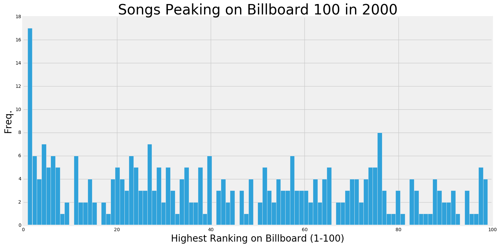
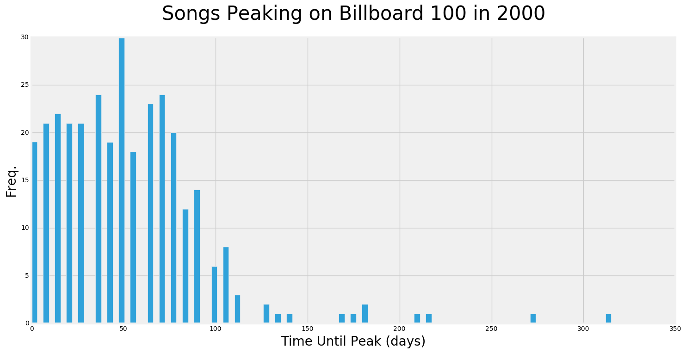
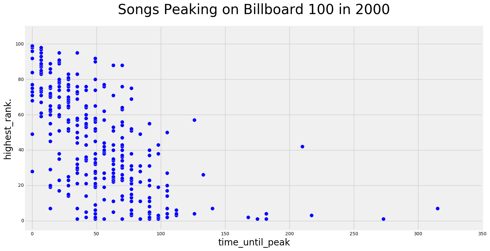

# Billboard 100 (2000)

## Introduction
In this second project for General Assembly's Data Science Immersive program I investigated the music of the 2000s. Specifically, I analyzed songs from the Billboard Hot 100 which peaked in the year 2000. My goal was to perform exploratory data analysis in order to better understand what makes a particular song reach the top of the charts.

## The Data
The dataset is taken from Billboard.com and provides a complete list of songs that peaked on the Billboard Hot 100 in the year 2000. Attributes of the dataset include Artist Name, Track Name, Song Length, Genre, Date Entered, Date Peaked, and a column for each week with a corresponding ranking.

The raw data was in .csv file format. I read in the source file to a (317 x 83) pandas dataframe. The resulting columns were all object data types with the exception of year (int64) and x1st.week (int64).

## Data Cleaning

#### Column Names
In order to get the dataset into a more useable format I first modified the column headers. This focused around making the column names more readable. I also wanted to make the weekly ranking columns (i.e. x1st.week) more concise.

    bb.columns = [x.replace('x','') for x in bb.columns]
    bb.columns = [x.replace('week','wk') for x in bb.columns]
    bb = bb.rename(columns={'artist_inverted': 'artist'})
    bb = bb.rename(columns={'time': 'song_length_(s)'})
    bb.columns = [x.replace('.',' _ ') for x in bb.columns]

#### Nan Values
After looking at the head of the dataframe I noted that a large portion of the weekly ranking columns contained the string " * " as a value. I replaced these values with NaN using the follow function:  

    def insert_nans(value):
      if value == ' * ':
        return np.nan
      else:
        return value

     bb = bb.applymap(insert_nans)

This allowed me to identify any columns that contained all NaN values. I removed the from the data set as follows:

    bb.dropna(axis='columns',how='all', inplace=True)

I then wanted to convert the weekly rank columns back to numerical values. I replaced all remaining NaN values with 0s using the follow function:

    def replace_nans(value):
      if pd.isnull(value):
        value = 0
      else:
        value=value
      return value

    bb = bb.applymap(replace_nans)

This allowed me to then convert all the weekly rank columns to data type 'integer' as follows:

    bb.iloc[:,7:] = bb.iloc[:,7:].astype(int)

#### Time Attributes

The billboard dataset contained 3 time related columns as data type 'object' ('song_length_(s)', 'date_entered', and 'date_peaked'). These columns needed to be converted to be more usuable.

Converted 'song_length_(s)' to seconds as data type 'integer':

    def convert_song_length(value):
      value = value.split(',')
      value = [int(value[i]) for i in range(0,2)]
      value = value[0] * 60 + value[1]
      value = pd.to_timedelta(value, unit='s')
      return value

    bb['song_length_(s)'] = bb['song_length_(s)'].apply(convert_song_length)
    bb['song_length_(s)'] = bb['song_length_(s)'].astype(int)
    bb['song_length_(s)'] = bb['song_length_(s)']//1000000000

Converted 'date_peaked' and 'date_entered' to date time objects:

    bb['date_entered'] = pd.to_datetime(bb['date_entered'])
    bb['date_peaked'] = pd.to_datetime(bb['date_peaked'])

I then created an additional column for 'time_until_peak':

    bb['time_until_peak'] = bb['date_peaked']-bb['date_entered']
#### Artist, Track, and Genre columns

My next step was to investigate the text string columns 'artist', 'track', and 'genre' columns. I wanted to determine if any of the values in these columns contained erroneously duplicated or mispelled values. I used the value_counts() method to scan through the entries for each column and made the following changes.

Within the 'genre' column, replaced 'R & B' with 'R&B':

    def change_rb(value):  
        if value == 'R & B':
            value = 'R&B'
        else:
            value = value

Corrected the cell containing '98 Degrees'. This cell previously displayed a character error:  

    bb.set_value(22,'artist','98 Degrees')

## Assumptions  

####Genre Validity
For the purpose of this analysis I assumed that each song/genre mapping was valid. However, upon further inspection certains red flags arise. For example, the 'Rock' is by far the largest genre and contains songs many might not consider to be Rock. For example, Christina Aguilera's 'Come On Over Baby' is considered 'Rock' in this dataset which some might find a controversial classification.

Additionally, I assumed that billboard decided to separate 'Rock' and 'Rock'n'roll' based on some meaningful distinction.

#### Scope
I was also careful to not extrapolate the findings of this analysis to be descriptive of music as a whole. This dataset represents a narrow time frame of just one year (2000) and is not necessarily an accurate reflection of the state of music in any other time frame.

In addition, there are a whole host of variables that might influence how a song enters the billboard 100 which are outside the scope of this analysis. Therefore, this ranking is not necessarily even a good measure of music popularity within the year 2000.

Therefore, this analysis focuses narrowly on what makes a song rank high specifically on the billboard 100 in the year 2000.

## Exploratory Analysis
To begin my exploratory analysis I wanted to understand the added column 'highest_rank'. From calculating the summary statistics of mean, median, mode, and standard deviation we see that highest rank has a high degree of variability across the dataset.

Plotting a histogram of the distribution shows the mode peak ranking of 1 has an outlier frequency of 37. Otherwise, most other rankings between 2 and 100 have a frequency between 1 and 8.

    highest_rank mean: 44.1230283912
    highest_rank median: 42.0
    highest_rank mode: ModeResult(mode=array([ 1.]), count=array([17]))
    highest_rank std: 29.223722476

Next I calculated the same summary statistics on 'time_until_peak'. Again, we see that the distribution has a high degree of variability.

Plotting a histogram shows a distribution centered around a mode of 49 days. We can also see that the distribution is positively skewed.

    time_until_peak mean: 52 days 05:54:19.305993
    time_until_peak median: 49 days 00:00:00
    time_until_peak mode: ModeResult(mode=array([4233600000000000], dtype='timedelta64[ns]'), count=array([30]))
    time_until_peak std: 40 days 20:49:20.696756

Next I wanted to investigate whether a correlation existed between 'time_until_peak' and 'highest_rank'. Plotting a scatterplot showed a negative correlation between the two variables. This is in line with my basic intuition that if a song remains on the billboard 100 longer, it is more likely to reach a higher ranking.

## Hypothesis Testing
