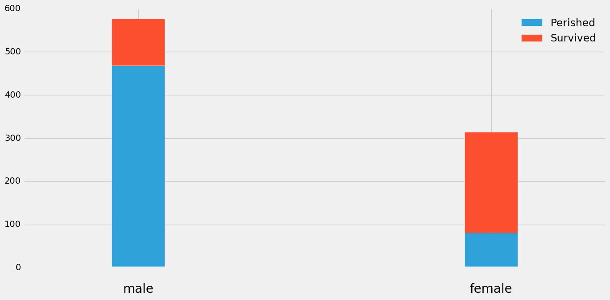
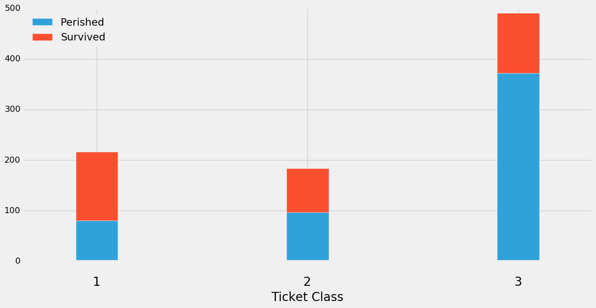
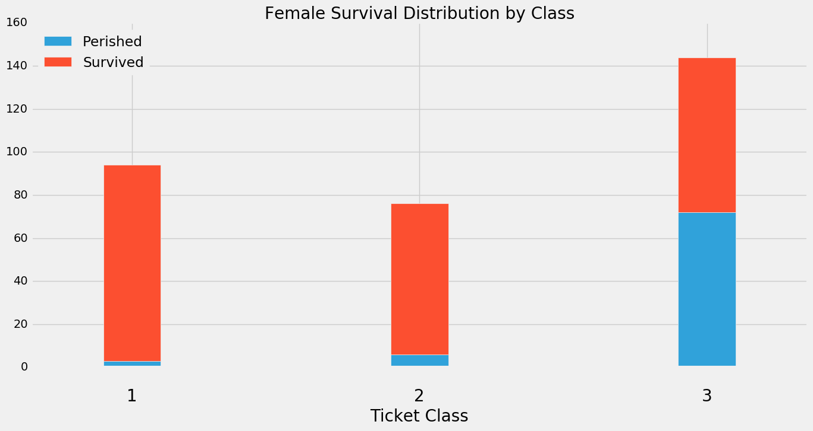

# Modeling Survivors of The Titanic Disaster

## Introduction
In this project we were tasked with taking on the role of a disaster response organization. Specifically, using historical data from the 1912 Titanic sinking we wanted to understand if certain features were predictive of survival. My goal was to identify which features were most important in predicting utilizing various modeling techniques.

## Risk & Assumptions
A few risks and assumptions were immediately apparent in regard to this exercise. The first relates to data integrity. The Titanic disaster was over a hundred years ago, making the likelihood data collection errors exceedingly high. Metrics such as Number of Siblings and Number of Parents would be difficult to validate at the time of the disaster let alone generations later. For the purpose of this analysis we will assume that the data set is indeed valid.

Another major risk relates to interpretability. Common knowledge of the Titanic disaster in popular culture quickly point to factors such as gender, class, and age as highly deterministic of survival. However, these factors are largely artifacts of the past. Although it may still be true that rich women and rich children would be more likely to survive a disaster, the social structures in place in the era of the Titanic have almost certainly shifted to a large degree. Additionally, the engineering flaws and blatant disregard for common sense safety measures on the Titanic ship offer little relevance to today's highly regulated ocean liner industry. Thus, this analysis is merely an exercise in machine learning classification techniques.   

Another assumption related to data methodology. Of the 891 rows in our dataset, 177 contained no value for 'Age'. Rather than impute the missing values, I converted this feature into several binary age range features. As a result passenger with no listed age would have 0 for each age range feature.

## Exploratory Analysis
The crux of my exploratory data analysis related to investigating some common knowledge regarding the Titanic. Specifically, I wanted to confirm the following:

Passengers were more likely to survive if:

* They were younger (child) vs older (adult)
* They were female vs. male
* They were in a higher ticket class

### Age

Plotting the passenger age distribution shows a relatively normal distribution with a mean of 29.7, mode of 24.0, and median of 28.0.  Looking at the survival distribution by age we can see that the 20-30 bucket contained both the most total passengers and the most passengers who perished. Looking at the survival rate plot we can see that the 20-30 bucket also represents the lowest survival rate with the exception of the 8 passengers in the 70-80 bucket.

The other major takeaway here is that young children (<10) had a significantly higher survival rate at over 60%. All other age buckets showed significantly less variability.

### Gender
Of the 891 passengers in the dataset 65% (577) were male. Looking at distribution it is clear that male passengers were far more likely than female passengers to have perished.

### Passenger Class
In terms of passenger class, 1st, 2nd, and 3rd class represented 55%, 21%, and 24% respectively of passengers in our sample. From the distribution below it is clear that the 3rd class contained by far the highest total passengers who perished as well as the lowest survival rate. 1st and 2nd class passengers were pretty similar with 1st class passengers showing a slightly higher survival rate.

### Passenger Gender/Class
Digging a little further we can see that the higher mortality rate in the 3rd class was far more apparent among female passengers. Mortality rates were generally high for males across all passenger classes.

## Methods
My next step was to build 3 classification models to predict whether a passenger survived or perished. The three models I choose were K Nearest Neighbors, Logistic Regression, and Random Forest. Classification models predict whether an observation falls into a discrete category (survival this case) based on an array of determinant features. This makes them distinct from regression models which are used to predict continuous variables. Typically, classification models are evaluated in terms of accuracy or (# correct predictions)/(# of total predictions).

### What is a K Nearest Neighbors model?
K Nearest Neighbors is a very simple model that classifies an observation based on the majority classification of a given number of its nearest neighbors. Distance in this context refers to the distance between points on a multidimensional feature plane.  It can therefore be difficult to conceptualize this distance when you have more than 3 features (dimensions). Various distance metrics can be used in this calculation, the most common being Euclidean distance. KNN models are popular because they are both simple, yet powerful enough to be common in many medical research applications. Interpretability is a short coming of these models because they do not implicitly offer insight into feature importance.

### What is a Logistic Regression model?
Despite the name, Logistic Regression is actually a type of classification algorithm. In essence, logistic regression mathematically transforms a simple linear regression to map a target variable onto a probability plane between 0 and 1. We consider this classification because we can set a probability threshold to assign each observation to one class or another. These models are beneficial because they are typically computationally light and give insight into the directionality of the predictive features. However these models can be difficult to interpret if all variables are not on the same scale. Additionally, the feature coefficients do not factor in how frequently a specific feature occurs in the dataset.

### What is a Random Forest model?
A random forest model is an ensemble model comprised of multiple decision trees. In essence a decision tree will select features to split data into categories based on overall information gain (typically defined as a decrease in entropy). A random forest builds multiple decision trees on different random subsets of the total data. Additionally, the features available for each tree to make splitting decisions on are also randomly assigned across trees. The result is multiple high variance inner models that when averaged create a low variance model less prone to overfitting concerns. RF models also give insight into feature importance that factors in the its prevalence in the dataset. One draw back of decision trees in general is that they do not give insight into the directionality of the predictive power of features.

## Results
### K Nearest Neighbors

* Accuracy: 0.81

|                           | Precision | Recall    | F1-Score  | Support |
|---------------------------|-----------|-----------|-----------|---------|
| Perished                  | 0.83      | 0.88      | 0.85      | 184     |
| Survived                  | 0.77      | 0.70      | 0.74      | 111     |
| Avg/Total                 | 0.81      | 0.81      | 0.81      | 295     |

### Logistic Regression

* Accuracy: 0.79

|                           | Precision | Recall    | F1-Score  | Support |
|---------------------------|-----------|-----------|-----------|---------|
| Perished                  | 0.84      | 0.82      | 0.83      | 184     |
| Survived                  | 0.71      | 0.74      | 0.73      | 111     |
| Avg/Total                 | 0.79      | 0.79      | 0.79      | 295     |

| Feature             | Coef.     |
|---------------------|-----------|
| Sex_male            | -2.844442 |
| Age Bucket_0 to 10  | 2.347737  |
| Pclass_3            | -1.796735 |
| FamSize             | -1.694811 |
| Embarked_S          | -0.794152 |
| Pclass_2            | -0.723945 |
| Age Bucket_10 to 20 | 0.212087  |
| Age Bucket_30 to 40 | 0.209203  |
|

### Random Forest

* Accuracy: 0.81

|                           | Precision | Recall    | F1-Score  | Support |
|---------------------------|-----------|-----------|-----------|---------|
| Perished                  | 0.84      | 0.86      | 0.85      | 184     |
| Survived                  | 0.76      | 0.74      | 0.75      | 111     |
| Avg/Total                 | 0.81      | 0.81      | 0.81      | 295     |

| Feature             | Importance |
|---------------------|------------|
| Sex_male            | 0.385885   |
| FamSize             | 0.201719   |
| Pclass_3            | 0.129332   |
| Embarked_S          | 0.059779   |
| Age Bucket_0 to 10  | 0.053294   |
| Pclass_2            | 0.038061   |
| Age Bucket_30 to 40 | 0.026794   |
| Age Bucket_20 to 30 | 0.025538   |
| Age Bucket_40 to 50 | 0.020763   |
| Age Bucket_10 to 20 | 0.018566   |
| Embarked_Q          | 0.016015   |
| Age Bucket_60 to 70 | 0.010167   |
| Age Bucket_50 to 60 | 0.009655   |
| Age Bucket_70 to 80 | 0.004432   |

## Conclusion

### Model performance

Each of the 3 classification models yielded very similar accuracy scores of approximately .80. This means that all 3 models were able to correctly classify a passenger's fate about 80% of the time. Alternatively we could also look at precision and recall to evaluate model performance. Precision is the measure of (True Positives)/(True Positives + False Positives) or alternatively (# passengers labeled 'perished' who actually perished)/(# of passengers labeled 'perished'). Recall is the measure of (True Positives)/ (True Positives + False Negatives) or (# passengers labeled 'perished' who actually perished)/(# of passengers who actually perished). F1 score is simply a weighted average of these two measures. Again we see consistency across the models with precision/recall around .85 for the 'perished' condition and about .75 for the 'survived' condition.

### Feature Importance
Despite the consistent performance between models the two that give us insight into feature importance tell slightly different stories. The logistic regression model yielded 'male gender', '<10 years of age', 'passenger class 3', 'family size', and 'embarked from Southampton' as the highest coefficients. With the exception of '<10 years of age', each of these features was negatively correlated with the probability of survival.

Looking at the random forest model we can see that the most import features are identical. However, note that the ordering of importance is different. While male gender is still the most determinant feature, the RF model ranks 'family size' as the second most import feature compared to '<10 years of age' in the logistic model. This is driven by the fact that despite '<10 years of age' being highly correlated with survival, it is not present frequently enough in the dataset to be ranked as the 2nd most importance feature by the RF model
